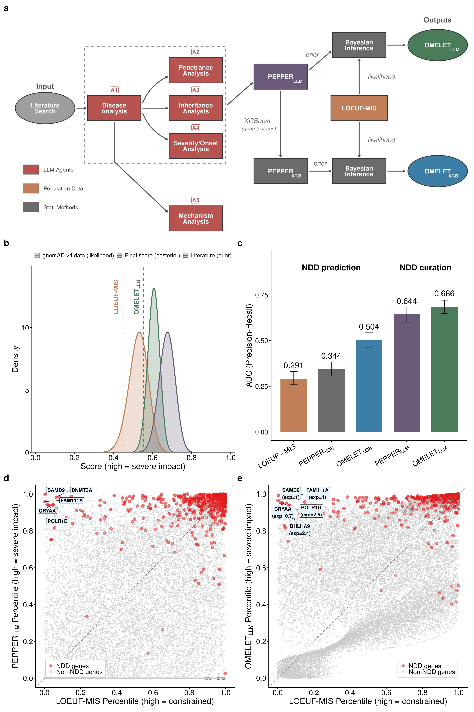
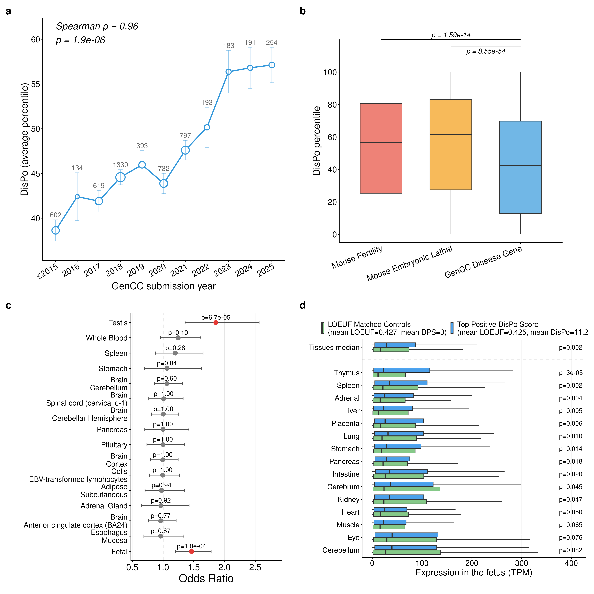
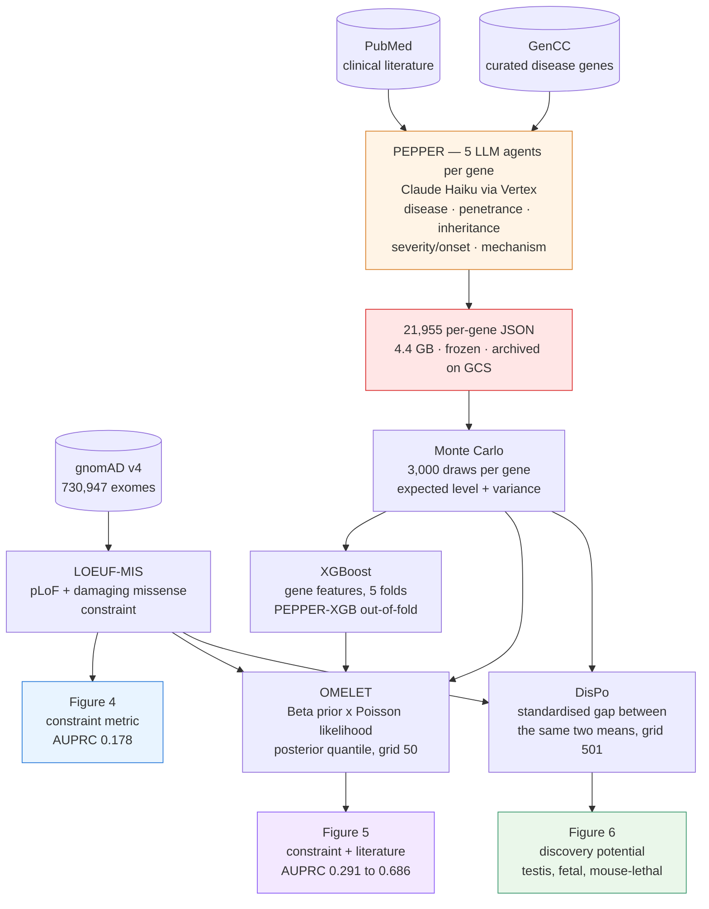

# Integrating 730,947 exome sequences with clinical literature improves gene discovery

Code and data for **Figures 4, 5 and 6** of the gnomAD v4 flagship paper
([medRxiv 2026.03.23.26349081](https://doi.org/10.64898/2026.03.23.26349081)).

The three figures make one argument in three steps. Figure 4 builds a
**constraint metric that adds damaging missense variants to the loss-of-function
counts** across 730,947 exomes, and shows it beats existing constraint metrics at
recovering known disease genes. Figure 5 pairs that
population-genetic signal with an orthogonal, literature-derived estimate of
**clinical impact** produced by a chain of LLM agents, and shows the combination
beats either ingredient alone. Figure 6 turns the argument around: where the two
signals **disagree**, the gene is a candidate disease gene that nobody has
described yet — and those candidates have exactly the properties you would
expect of phenotypes that are hard to observe in humans.

---

## Contents

- [The scientific argument](#the-scientific-argument)
  - [Figure 4 — a constraint metric combining pLoF and missense variation](#figure-4--a-constraint-metric-combining-plof-and-missense-variation)
  - [Figure 5 — combining constraint with the literature (PEPPER, OMELET)](#figure-5--combining-constraint-with-the-literature-pepper-omelet)
  - [Figure 6 — mining the disagreement (DisPo)](#figure-6--mining-the-disagreement-dispo)
- [Architecture](#architecture)
- [Running it](#running-it)
- [The per-gene JSON files](#the-per-gene-json-files)
- [What reproduces, and how exactly](#what-reproduces-and-how-exactly)
- [Repository layout](#repository-layout)
- [Further reading](#further-reading)

---

## The scientific argument

### Figure 4 — a constraint metric combining pLoF and missense variation


Loss-of-function constraint (LOEUF) works well but rests on a thin slice of the
data: pLoF variants are rare, so thousands of genes carry too few to be
informative. Figure 4 asks whether damaging missense variants can supply the
missing signal.

**LOEUF-MIS is the answer, and it is not a missense-only metric.** It counts the
pLoF variants — under the LOFTEE-2 relaxed filter — **plus** the most damaging
missense variants, taken at the 99th percentile of ESM1v, PopEVE and
AlphaMissense and averaged across the three. Observed and expected counts are
summed over that union, and the metric is the upper bound of the 90% confidence
interval on the resulting o/e ratio, exactly as LOEUF is for pLoFs alone. So it
is LOEUF's estimator applied to a larger variant set, which is why it stays
informative in genes where pLoF counts run out.

- **Panel a** ranks missense variants by predictor score and plots the
  observed/expected ratio at each percentile. All three predictors — ESM1v,
  PopEVE, AlphaMissense — show the ratio falling from the synonymous baseline
  (o/e ≈ 1.0) towards the pLoF level (o/e ≈ 0.55) as the score rises. High-score
  missense variants really are depleted, so they carry constraint information.
- **Panel b** tests where the resulting metric finds signal, by gene category:
  bar height is −log10 of a Fisher p-value, the number above each bar is the
  fold enrichment. Ion channels and helicases lead, followed by kinases, OMIM
  genes, oncogenes and GoF/DN genes.
- **Panel c** compares observed against expected variant counts for pLoFs and
  for each missense predictor, in all genes and in NDD genes separately. In NDD
  genes the missense sets are depleted more strongly than the pLoFs themselves
  (o/e 0.09–0.20 against 0.30), so they are not a weaker substitute for pLoF
  counts but an independent source of the same signal — which is what justifies
  summing the two.
- **Panel d** is the payoff: precision-recall curves for recovering known
  neurodevelopmental disorder genes. **LOEUF-MIS** reaches AUPRC **0.178**,
  against 0.128 for LOEUF v4, 0.103 for GeneBayes and 0.075 for LOEUF v2.

The 0.128 → 0.178 step is worth reading carefully, because it is a controlled
ablation rather than a comparison across published scores. The curve labelled
LOEUF v4 is computed in `figure_4.R` from the *same* LOFTEE-2 relaxed pLoF counts
and the *same* confidence-bound estimator as LOEUF-MIS; the only difference
between the two is the added missense counts. The gain is therefore attributable
to the missense contribution and not to a change of LoF filter — though a reader
should know that this curve is a recomputation and not gnomAD v4's published
LOEUF.

LOEUF-MIS is the input the next two figures consume.

### Figure 5 — combining constraint with the literature (PEPPER, OMELET)



Constraint measures how strongly selection acts on a gene *in a population*. It
says nothing about what the gene does clinically. The clinical literature says a
great deal about that, but not in a form a model can use. Figure 5 extracts it.

**PEPPER** is a chain of LLM agents (`agentic_pipeline/stages/s1_agents/`). For
each of 21,955 genes it searches PubMed, retrieves up to 50 abstracts, and runs
five agents over them (**panel a**). A disease agent (A1) identifies the
phenotypes; penetrance (A2), inheritance (A3) and severity/onset (A4) agents
score each phenotype on a five-level scale; a mechanism agent (A5) classifies the
mode of action. A Monte Carlo over those per-axis distributions — 3,000 draws per
gene — combines them into a composite level from 1 (lethal or profoundly
disabling) to 7 (no phenotype found in the literature), and returns both its
expectation and, crucially, **a variance**.

**OMELET** combines the two signals in a Bayesian framework. The PEPPER score
becomes a **Beta prior** on the fraction of loss-of-function variation a gene
tolerates; the gnomAD observed and expected counts behind LOEUF-MIS become a
**Poisson likelihood**; the posterior is the OMELET score. The agents' own
variance sets the prior's concentration κ, so a gene the literature describes
confidently gets a sharp prior and one it barely mentions gets a diffuse one.
**Panel b** shows the update for a single gene, ABCC9: literature prior in
purple, gnomAD likelihood in orange, posterior in green.

**Panel c** is the quantitative claim, as AUPRC for NDD gene recovery:

| Score | AUPRC | Uses the literature? |
|---|---|---|
| LOEUF-MIS alone | 0.291 | no |
| PEPPER<sub>XGB</sub> | 0.344 | no — XGBoost on gene features |
| OMELET<sub>XGB</sub> | **0.504** | no |
| PEPPER<sub>LLM</sub> | 0.644 | yes |
| OMELET<sub>LLM</sub> | **0.686** | yes |

The dashed line in the panel separates the two regimes, and the distinction
matters when reading the numbers. The left three are **prediction**: nothing
gene-specific from the literature enters, so the comparison is fair against
LOEUF-MIS. The right two are **curation**: PEPPER<sub>LLM</sub> has read the
papers, including the ones that established these genes as NDD genes, so its
0.644 measures how well the agents extract what is already known, not how well
they predict the unknown. In both regimes the Bayesian step helps —
0.291 → 0.504 and 0.644 → 0.686 — which is the point being made.

**Panels d and e** plot the two axes against each other, NDD genes in red. In
panel d the cloud is diffuse: constraint and literature disagree for many genes.
Panel e shows the posterior pulling the cloud towards the diagonal. The genes
that stay far from it are what Figure 6 is about.

### Figure 6 — mining the disagreement (DisPo)



**DisPo** (discovery potential) uses the same two ingredients as OMELET for the
opposite purpose. OMELET multiplies prior and likelihood because agreement
sharpens a constraint estimate. DisPo keeps them apart and reports the
standardised gap between their means, because *disagreement* is the signal: a
gene under strong selection with no described disease is a gene whose phenotype
we have not found yet. 18,124 of the 21,955 genes get a DisPo value; the rest
lack the gnomAD counts it needs.

The figure asks whether high-DisPo genes behave like undiscovered disease genes.

- **Panel a** plots mean DisPo against the year a gene entered GenCC. It rises
  monotonically, Spearman ρ = 0.96, p = 1.9 × 10⁻⁶: the more recently a gene was
  recognised as a disease gene, the higher its DisPo. Genes still unrecognised
  should therefore sit higher still.
- **Panel b** compares DisPo across gene sets. Mouse fertility genes and mouse
  embryonic-lethal genes score higher than established GenCC disease genes
  (p = 1.6 × 10⁻¹⁴ and 8.6 × 10⁻⁵⁴) — phenotypes that are severe but, in humans,
  invisible to clinical ascertainment.
- **Panel c** tests tissue-specific expression among high-DisPo genes across
  every GTEx tissue. Two are enriched and only two: **testis** (OR = 1.86,
  95% CI 1.36–2.56, p = 6.7 × 10⁻⁵) and **fetal** tissue (OR = 1.46,
  p = 1.0 × 10⁻⁴). No adult somatic tissue is.
- **Panel d** confirms the fetal result directly, comparing fetal expression of
  top-DisPo genes against LOEUF-matched controls tissue by tissue.

Reproductive and prenatal phenotypes are precisely the ones a clinical genetics
cohort does not see. That is the argument the figure closes.

---

## Architecture



Two things are worth noting in that graph. OMELET and DisPo are the same two
distributions combined differently, which is why they read the same inputs and
why their evaluation grids differ (50 points suffice for a posterior quantile,
501 are needed for the variances DisPo compares). And the LLM stage is the only
one that is not reproducible — everything downstream of the frozen JSON is
exact, to the bit.

---

## Running it

The reference environment is R 4.5.2 and CPython 3.14.4; both dependency files
pin exact versions, because a numpy or scipy minor bump can move the last digits
of a float and the Monte Carlo stage is expected to be bit-for-bit reproducible.
Every table the figures read is in the repository, so nothing needs downloading.

```bash
pip install -r agentic_pipeline/env/requirements.txt
Rscript agentic_pipeline/env/install_r_deps.R          # audits the pinned R versions
```

**Figure 4** is self-contained, and writes its panels straight into
`Figure_4/figures/`, overwriting the committed ones:

```bash
cd Figure_4 && Rscript figure_4.R
```

**Figures 5 and 6** go through drivers that isolate the run in a work directory,
so the committed figures are never overwritten:

```bash
agentic_pipeline/stages/s5_figures/run_figure6.sh      # ~50 s
agentic_pipeline/stages/s3_xgboost/run_xgboost.sh      # ~45 s
agentic_pipeline/stages/s5_figures/run_figure5.sh      # ~90 s
```

Both drivers pin the collation to `en_US.UTF-8` and refuse to start if that
locale is missing. This is not cosmetic: Figure 6's panel A orders its x-axis by
sorting labels, one of which is `<2015`, and under `C` collation that bucket is
drawn last instead of first, breaking the chronology while leaving every value
unchanged. R accepts an unavailable locale silently, so the check has to be
explicit ([CORRIGENDA item 16](agentic_pipeline/CORRIGENDA.md)).

To re-derive Figures 5 and 6 from the agent outputs rather than from the
committed tables, or to run the agents themselves, see
[`agentic_pipeline/README.md`](agentic_pipeline/README.md).

---

## The per-gene JSON files

These are the raw material of Figures 5 and 6, and the one artefact that can be
regenerated but not reproduced. The agent code is here and runnable, under
`agentic_pipeline/stages/s1_agents/`, so producing a fresh set is a matter of
compute; producing *this* set again is not possible, which is why the published
one survives only by being kept. One file per gene, 21,955 of them, 4.4 GB in
total. Each records the complete trace of what the agents saw and concluded:

| Field | Contents |
|---|---|
| `raw_articles` | up to 50 PubMed abstracts with PMID and publication date |
| `search_config` | the keywords, article count and date bounds used |
| `deep_analysis.diseases` | one entry per phenotype, with each agent's scores |
| `deep_analysis.distributions` | per-axis distributions over penetrance, inheritance, onset/severity |
| `deep_analysis.level_distribution` | the composite distribution over levels 1–7 |
| `deep_analysis.expected_level`, `level_variance` | what stages 2 and 3 actually consume |
| `deep_analysis.kappa` | prior concentration implied by that variance |
| `all_scores` | LOEUF-MIS, v2 and v4 with their obs/exp counts |
| `gencc_comparison` | agreement with GenCC, phenotype by phenotype |
| `deep_analysis._raw_llm`, `timing` | verbatim model output and per-agent timings |

**Why they are frozen.** The agents query PubMed, whose corpus grows daily, so
the same gene scored a month later can legitimately get a different answer. A
full rerun also costs roughly $800 in inference. The run behind the published
figures (`run_016`) is therefore treated as the reproducibility boundary of the
project, and protected three ways: the directory is read-only, all 22,519 files
are checksummed in `SHA256SUMS.results`, and a verified archive sits in a
versioned GCS bucket. The stage-2 script has an `--update-json` flag that
rewrites its inputs in place; in this repository it refuses to run.

```bash
gcloud storage cp gs://llm_agents_bucket/archives/run_016/run_016_results.tar.zst .
tar -I 'zstd -d --long=27' -xf run_016_results.tar.zst      # 233 MB -> 4.4 GB
```

Rerunning the agents is supported, but only against a new run identifier, and
`--max-pubdate` is the only lever that makes the protocol replayable — it bounds
the corpus, which fixes the inputs even though it cannot fix the model.

---

## What reproduces, and how exactly

Every claim below is checked by a test. `--full` runs 116 assertions and all of
them pass; the smoke test is separate because it costs money to run.

| Stage | Feeds | Reproducibility |
|---|---|---|
| LLM agents | both figures | **None, by construction** — verified only by a 5-gene smoke test |
| Monte Carlo / DisPo | Figure 6 | Bit-identical |
| Fetal expression merge | Figure 6 | Bit-identical |
| XGBoost out-of-fold | Figure 5 | Bit-identical |
| OMELET | Figure 5 | Independent Python reimplementation agrees with the R original to 1e-14 over 17,167 genes |
| Assembled Figure 6 | — | Bit-identical |
| Assembled Figure 5 | — | Bit-identical on this graphics stack; numbers exact on any |

```bash
agentic_pipeline/tests/run_tests.sh            # fast checks, seconds
agentic_pipeline/tests/run_tests.sh --full     # + four regressions, ~6 min
agentic_pipeline/tests/run_tests.sh --smoke    # + 5 genes through Vertex (billed)
```

Figure 5's assembled PNG is the one caveat. It reproduces exactly here, but not
across machines: `ragg`, `systemfonts` and `textshaping` were updated in April
2026 and rasterise text with slightly more weight, which makes ggplot reserve
more room for rotated axis labels and draw each panel 0.27% smaller. 6.90% of
pixels change without a single plotted point moving — bar height ratios still
agree to 0.03%. The test therefore compares the **numbers** exactly and the
**pixels** against a band calibrated on that measurement. The reasoning is set
out in [`agentic_pipeline/README.md`](agentic_pipeline/README.md).

Figure 4 is not covered by this harness. It is a self-contained visualisation
layer reading pre-computed tables, including a cached `df_pair_cached.rds` whose
upstream derivation is not in this repository.

---

## Repository layout

```
.
├── Figure_4/                 constraint metric — standalone R script + data
├── Figure_5/                 PEPPER / OMELET — figure script, data, figures
├── Figure_6/                 DisPo — data and figures (main_figure2_new is current)
├── Supplementary Datasets/   datasets 1–3; dataset 4 is 1.24 GB and hosted outside
├── agentic_pipeline/         the pipelines behind Figures 5 and 6, and the tests
├── SHA256SUMS                84 checksummed files: every data table and figure
└── SHA256SUMS.external       checksums for supplementary dataset 4
```

`Figure_5/figures/` and `Figure_6/figures/main_figure2_new.*` hold the
pipeline's own output, so the regression tests compare a rerun against a figure
this repository produced rather than an artefact from elsewhere. The March 2026
renders are preserved under the `figures-frozen-2026-08` tag.

---

## Further reading

| Document | What it covers |
|---|---|
| [`agentic_pipeline/README.md`](agentic_pipeline/README.md) | the pipelines in detail: stages, parameters, tests, reproducibility |
| [`agentic_pipeline/CORRIGENDA.md`](agentic_pipeline/CORRIGENDA.md) | 16 corrections to carry over to the preprint, each measured |
| [`agentic_pipeline/config/run_016.yaml`](agentic_pipeline/config/run_016.yaml) | every parameter of the published run — the authoritative record |
| [`agentic_pipeline/methods/dispo.py`](agentic_pipeline/methods/dispo.py) | DisPo, reimplemented to be read rather than run |
| [`agentic_pipeline/methods/omelet.py`](agentic_pipeline/methods/omelet.py) | OMELET, likewise |
| [`agentic_pipeline/PLAN.md`](agentic_pipeline/PLAN.md) | how the pipeline was reconstructed, and what was decided along the way |

Two things a reader should know before quoting numbers from these figures. The
published `predictions_no_go.csv` behind Figure 5 was trained on the February
2026 Monte Carlo table while the repository also ships the March one, and both
are now versioned so the discrepancy is measurable rather than invisible. And
`monte_carlo_min.tsv` predates a correction to how composite loss-of-function
mechanisms are handled; Figure 6 here is the corrected `_new` variant.
CORRIGENDA items 11 and 1 give the numbers.

## License

See [LICENSE](LICENSE).
