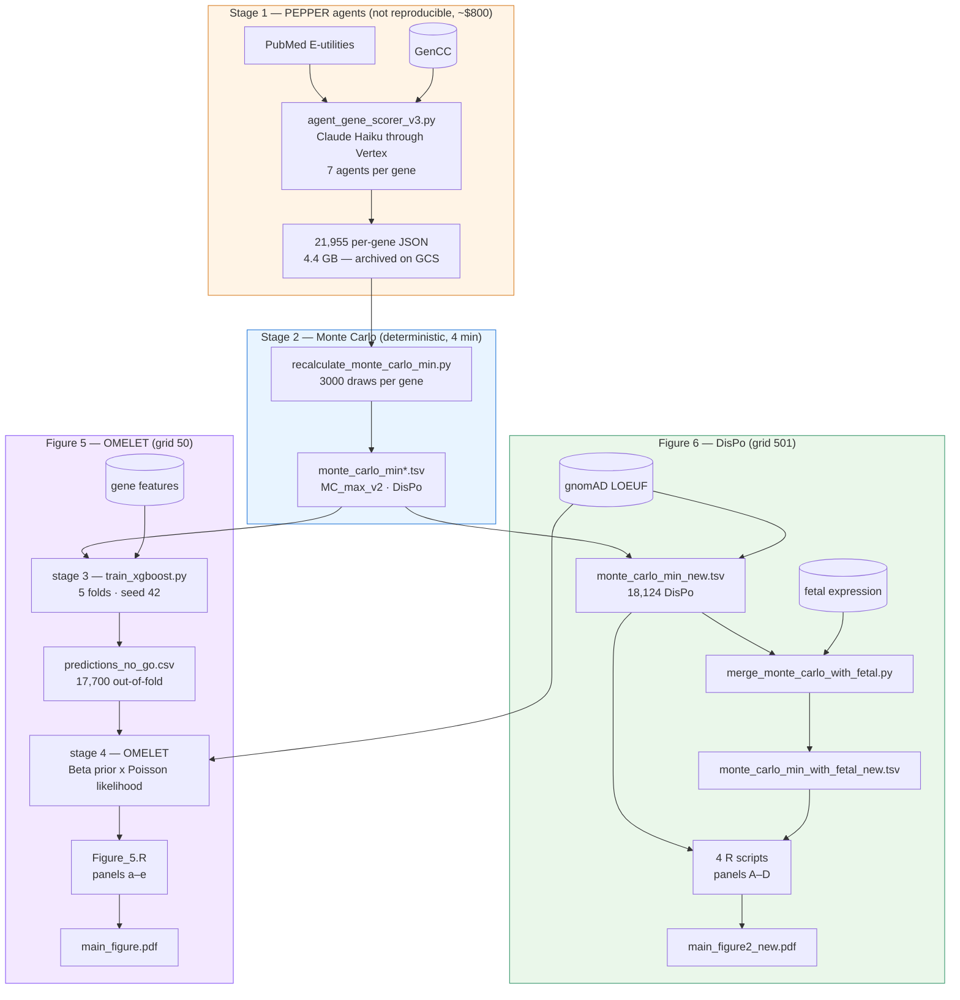

# PEPPER / OMELET / DisPo — the pipelines behind Figures 5 and 6

This directory holds the complete pipelines that produce **Figure 5** and
**Figure 6** (the `_new` variant of the latter), from the LLM agents through to
the assembled figures.

Until now the repository carried only the visualisation layer: the figures read
tables that nobody could trace back to a source. Everything upstream lived in a
private working repository. `agentic_pipeline/` fills that gap, and proves it
with tests.

## What is demonstrated

| Stage | Feeds | Reproducible | Verified by |
|---|---|---|---|
| 1 — LLM agents | both | No, by construction | 5-gene smoke test |
| 2 — Monte Carlo / DisPo | Figure 6 | Bit-identical | `2e3991bd…` |
| 2 — fetal expression merge | Figure 6 | Bit-identical | `a34df6f3…` |
| 3 — XGBoost out-of-fold | Figure 5 | Bit-identical | `ddd54bdb…` |
| 4 — OMELET | Figure 5 | Agrees with R to 1e-14 | 17,167 genes |
| 5 — assembled Figure 6 | — | Pixel-identical | `b8bd321f…` |
| 5 — assembled Figure 5 | — | Numbers exact, pixels within tolerance | see below |

Stage 1 is not reproducible and never will be: the agents query PubMed, whose
corpus grows every day, and a full run costs roughly $800. That is why its
outputs are **frozen** and treated as the reproducibility boundary of the
project. Everything downstream of it is exact, with one honest caveat about
Figure 5's pixels, explained under *Why Figure 5 is not bit-identical*.

## Architecture



OMELET and DisPo are the same two ingredients combined for opposite purposes.
Both build a Beta prior from a PEPPER literature score and a Poisson likelihood
from gnomAD counts. OMELET **multiplies** them and reports a quantile of the
posterior, because agreement is what improves a constraint estimate. DisPo
keeps them **apart** and reports the standardised gap between their means,
because disagreement is what flags an undescribed disease gene. That is also
why the grids differ — 50 points for a quantile, 501 for the variances DisPo
needs on both sides. See [`methods/omelet.py`](methods/omelet.py) and
[`methods/dispo.py`](methods/dispo.py), which are written to be read.

## Reproducing

Nothing needs to be downloaded: every reference table lives in the repository.

```bash
pip install -r agentic_pipeline/env/requirements.txt
Rscript agentic_pipeline/env/install_r_deps.R      # audit the R versions

agentic_pipeline/stages/s5_figures/run_figure6.sh  # ~50 s
agentic_pipeline/stages/s3_xgboost/run_xgboost.sh  # ~45 s
agentic_pipeline/stages/s5_figures/run_figure5.sh  # ~90 s
```

Both figure drivers write into a work directory and leave `Figure_5/figures/`
and `Figure_6/figures/` untouched; `run_figure5.sh` verifies that afterwards
and fails loudly if it is not true.

### Starting from the agent outputs

The 21,955 JSON files (4.4 GB) live outside the repository. To redo stage 2:

```bash
gcloud storage cp gs://llm_agents_bucket/archives/run_016/run_016_results.tar.zst .
tar -I 'zstd -d --long=27' -xf run_016_results.tar.zst
export PEPPER_RUN_016_RESULTS="$PWD/results"

python3 agentic_pipeline/stages/s2_montecarlo/recalculate_monte_carlo_min.py run_016 \
  --results-dir "$PEPPER_RUN_016_RESULTS" \
  --output /var/tmp/monte_carlo_min_new.tsv \
  --loeuf-file Figure_6/data/obs_exp_for_loeuf_missense_max.tsv \
  --algo-version v2 --composite-mode strict --unknown-prior benign \
  --kappa-min 1 --kappa-max 100000 --samples 3000
```

Every parameter is recorded in [`config/run_016.yaml`](config/run_016.yaml),
which is authoritative. None of them is optional: the script's default κ bounds
(`[20, 300]`) yield a different figure.

### Rerunning the agents

Only ever against a **new run identifier**, never against `run_016`:

```bash
cp agentic_pipeline/.env.example agentic_pipeline/.env   # then fill it in
gcloud auth application-default login                    # Vertex, no API key

cd agentic_pipeline/stages/s1_agents
python3 agent_gene_scorer_v3.py --genes BRCA1 TP53 \
  --model claude-haiku-4-5@vertex --output_dir /var/tmp/my_run --new \
  --max-pubdate 2025/12/29
```

`--max-pubdate` is the only reproducibility lever stage 1 has: it bounds the
PubMed corpus and makes the protocol replayable, if not the numbers.

## Why Figure 5 is not bit-identical

It is the only claim in this directory that is not exact, so it is worth being
precise about what happened.

`Figure_5.R` is deterministic: two runs on the same machine produce the same
bytes. It also faithfully reproduces the upstream original — the committed PNG
and the March 2026 run differ by 0.07% of pixels. But regenerating it *today*
changes 6.90% of pixels, and the reason is not the code. `ragg`, `systemfonts`
and `textshaping` were all updated on 6–7 April 2026, after the figure was
committed. The graphics stack antialiases differently now.

Zooming in confirms it: every plotted point sits at exactly the same
coordinates, and only the antialiased rim of each marker differs. Figure 6
escapes this because its reference was generated in June, after the update.

So `test_figure5_regression.py` splits the claim. The **numbers** are compared
exactly — gene counts, the ABCC9 prior concentration, both Spearman
correlations, and the five AUC-PR values that are the substance of panel C. The
**pixels** are compared against a band calibrated on real measurements:
antialiasing alone gives a mean absolute error of 1.71/255 and 0.295% of pixels
off by more than half scale, whereas two genuinely different panels give
17.3/255 and 3.5%. The thresholds (4.0 and 1%) sit in that gap.

## Tests

```bash
agentic_pipeline/tests/run_tests.sh          # a few seconds
agentic_pipeline/tests/run_tests.sh --full   # + the four regressions (~7 min)
agentic_pipeline/tests/run_tests.sh --smoke  # + 5 genes through Vertex (billed)
```

| Test | What it guarantees |
|---|---|
| `test_artifacts.py` | Checksums, shape and business rules of the reference tables |
| `test_methods_dispo.py` | An independent reimplementation of DisPo recovers all 18,124 values |
| `test_methods_omelet.py` | An independent reimplementation of OMELET agrees with R on 17,167 genes |
| `test_guardrails.py` | The frozen outputs stay frozen; no secret is published |
| `test_dispo_regression.py` | Recomputed stage 2 is bit-identical |
| `test_figure6_regression.py` | The regenerated Figure 6 is bit-identical |
| `test_xgboost_regression.py` | The regenerated out-of-fold predictions are bit-identical |
| `test_figure5_regression.py` | Figure 5's numbers are exact and its pixels within tolerance |
| `test_smoke_agent.sh` | The agent chain still runs and emits the right schema |

The smoke test deliberately does **not** check the scores. Two runs of the same
gene may legitimately differ, since the literature moved in between; claiming
otherwise would be a test that lies.

## Protecting the frozen data

The 4.4 GB of JSON are the product of an irreplaceable run. Three protections:

1. `results/` is read-only (directories 555, files 444);
2. `SHA256SUMS.results` lists all 22,519 files, checksum by checksum;
3. a verified archive sits on `gs://llm_agents_bucket/archives/run_016/`, in a
   versioned bucket.

The stage 2 script accepts an `--update-json` flag that rewrites the input JSON
in place. In this repository it **refuses** to run: a copy-pasted command must
not be able to destroy the reference.

## Layout

```
agentic_pipeline/
├── config/run_016.yaml      parameters of the published run — single source of truth
├── env/                     pinned Python and R dependencies
├── methods/
│   ├── dispo.py             the DisPo computation, written to be read
│   ├── omelet.py            the OMELET computation, written to be read
│   ├── dump_omelet_reference.R   exports the R intermediates, so Python can be checked
│   └── audit_duplication.py audit of the R function duplication
├── stages/
│   ├── s1_agents/           LLM agents (Vertex), prompts, services
│   ├── s2_montecarlo/       Monte Carlo, DisPo, fetal merge
│   ├── s3_xgboost/          out-of-fold PEPPER_XGB predictions
│   └── s5_figures/          the R scripts and the two figure drivers
└── tests/                   the harness described above
```

There is no `s4_omelet/` directory. OMELET has no standalone stage: it is
computed inside `Figure_5.R` at plotting time. Rather than move it — which
would risk changing a published figure while claiming to reproduce it — it is
reimplemented and validated in `methods/omelet.py`, and the R original is left
where it is.

## Deliberate deviations from the published run

Three differences, all documented in `config/run_016.yaml`:

- **Vertex instead of the direct Anthropic API.** Same weights, different
  billing and authentication. Suffix the model with `@vertex`.
- **Mechanism prompt v2 by default.** `run_016` was scored with v1 and then
  re-annotated with v2 over 562 genes in March 2026; the published tables
  reflect the v2 state. A fresh v1 run would produce no composite mechanism at
  all, `--composite-mode strict` would exclude nothing, and DisPo would shift
  silently. `PEPPER_MECHANISM_PROMPT_VERSION=v1` restores the old behaviour.
- **No NCBI key by default.** The upstream version carried one in source; it
  must be treated as compromised and rotated. Without a key, PubMed remains
  usable at 3 requests/s instead of 10.

One further point is not a deviation but a finding, and it matters for Figure 5:
the published `predictions_no_go.csv` was trained on the **February** Monte
Carlo table, while the repository ships the **March** one. Both are now
versioned, and the consequences are measured in
[`CORRIGENDA.md`](CORRIGENDA.md), along with the other corrections to carry
over to the preprint.
