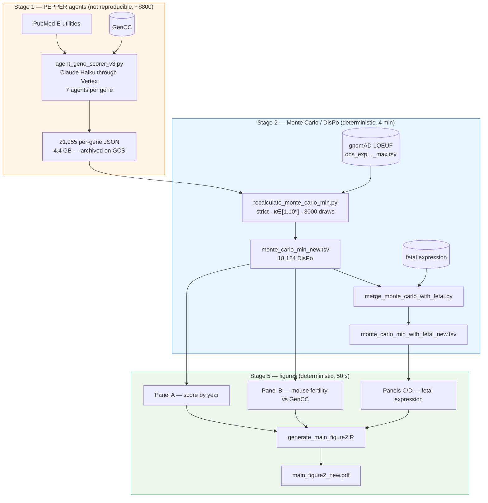

# PEPPER / DisPo — the Figure 6 pipeline

This directory holds the complete pipeline that produces **Figure 6** (the
`_new` variant), from the LLM agents through to the assembled figure.

Until now the repository carried only the visualisation layer: the figures read
tables that nobody could trace back to a source. Everything upstream lived in a
private working repository. `agentic_pipeline/` fills that gap, and proves it
with tests.

## What is demonstrated

| Stage | Reproducible | Verified by |
|---|---|---|
| LLM agents | No, by construction | 5-gene smoke test |
| Monte Carlo / DisPo | Bit-identical | `2e3991bd…` |
| Fetal expression merge | Bit-identical | `a34df6f3…` |
| Assembled Figure 6 | Pixel-identical | `b8bd321f…` |

Stage 1 is not reproducible and never will be: the agents query PubMed, whose
corpus grows every day, and a full run costs roughly $800. That is why its
outputs are **frozen** and treated as the reproducibility boundary of the
project. Everything downstream of it is exact.

## Architecture



## Reproducing

### Without downloading anything

The reference tables live in the repository, so the figure regenerates on its
own:

```bash
pip install -r agentic_pipeline/env/requirements.txt
Rscript agentic_pipeline/env/install_r_deps.R      # audit the R versions

agentic_pipeline/stages/s5_figures/run_figure6.sh
```

About 50 seconds, and the resulting PNG is bit-identical to
`Figure_6/figures/main_figure2_new.png`.

### Starting from the agent outputs

The 21,955 JSON files (4.4 GB) live outside the repository. To redo stage 2:

```bash
gcloud storage cp gs://llm_agents_bucket/archives/run_016/run_016_results.tar.zst .
tar -I 'zstd -d --long=27' -xf run_016_results.tar.zst
export PEPPER_RUN_016_RESULTS="$PWD/results"

python3 agentic_pipeline/stages/s2_montecarlo/recalculate_monte_carlo_min.py run_016 \
  --results-dir "$PEPPER_RUN_016_RESULTS" \
  --output /var/tmp/monte_carlo_min_new.tsv \
  --loeuf-file Figure_6/data/obs_exp_for_loeuf_missense_max.tsv \
  --algo-version v2 --composite-mode strict --unknown-prior benign \
  --kappa-min 1 --kappa-max 100000 --samples 3000
```

Every parameter is recorded in [`config/run_016.yaml`](config/run_016.yaml),
which is authoritative. None of them is optional: the script's default κ bounds
(`[20, 300]`) yield a different figure.

### Rerunning the agents

Only ever against a **new run identifier**, never against `run_016`:

```bash
cp agentic_pipeline/.env.example agentic_pipeline/.env   # then fill it in
gcloud auth application-default login                    # Vertex, no API key

cd agentic_pipeline/stages/s1_agents
python3 agent_gene_scorer_v3.py --genes BRCA1 TP53 \
  --model claude-haiku-4-5@vertex --output_dir /var/tmp/my_run --new \
  --max-pubdate 2025/12/29
```

`--max-pubdate` is the only reproducibility lever stage 1 has: it bounds the
PubMed corpus and makes the protocol replayable, if not the numbers.

## Tests

```bash
agentic_pipeline/tests/run_tests.sh          # a few seconds
agentic_pipeline/tests/run_tests.sh --full   # + DisPo and figure regressions (~5 min)
agentic_pipeline/tests/run_tests.sh --smoke  # + 5 genes through Vertex (billed)
```

| Test | What it guarantees |
|---|---|
| `test_artifacts.py` | Checksums, shape and business rules of the reference tables |
| `test_methods_dispo.py` | An independent reimplementation of DisPo recovers all 18,124 values |
| `test_guardrails.py` | The frozen outputs stay frozen; no secret is published |
| `test_dispo_regression.py` | Recomputed stage 2 is bit-identical |
| `test_figure_regression.py` | The regenerated Figure 6 is bit-identical |
| `test_smoke_agent.sh` | The agent chain still runs and emits the right schema |

The smoke test deliberately does **not** check the scores. Two runs of the same
gene may legitimately differ, since the literature moved in between; claiming
otherwise would be a test that lies.

## Protecting the frozen data

The 4.4 GB of JSON are the product of an irreplaceable run. Three protections:

1. `results/` is read-only (directories 555, files 444);
2. `SHA256SUMS.results` lists all 22,519 files, checksum by checksum;
3. a verified archive sits on `gs://llm_agents_bucket/archives/run_016/`, in a
   versioned bucket.

The stage 2 script accepts an `--update-json` flag that rewrites the input JSON
in place. In this repository it **refuses** to run: a copy-pasted command must
not be able to destroy the reference.

## Layout

```
agentic_pipeline/
├── config/run_016.yaml      parameters of the published run — single source of truth
├── env/                     pinned Python and R dependencies
├── methods/
│   ├── dispo.py             the DisPo computation, written to be read
│   └── audit_duplication.py audit of the R function duplication
├── stages/
│   ├── s1_agents/           LLM agents (Vertex), prompts, services
│   ├── s2_montecarlo/       Monte Carlo, DisPo, fetal merge
│   └── s5_figures/          the 4 R scripts and their driver
└── tests/                   the harness described above
```

## Deliberate deviations from the published run

Three differences, all documented in `config/run_016.yaml`:

- **Vertex instead of the direct Anthropic API.** Same weights, different
  billing and authentication. Suffix the model with `@vertex`.
- **Mechanism prompt v2 by default.** `run_016` was scored with v1 and then
  re-annotated with v2 over 562 genes in March 2026; the published tables
  reflect the v2 state. A fresh v1 run would produce no composite mechanism at
  all, `--composite-mode strict` would exclude nothing, and DisPo would shift
  silently. `PEPPER_MECHANISM_PROMPT_VERSION=v1` restores the old behaviour.
- **No NCBI key by default.** The upstream version carried one in source; it
  must be treated as compromised and rotated. Without a key, PubMed remains
  usable at 3 requests/s instead of 10.

The corrections to carry over to the preprint are collected in
[`CORRIGENDA.md`](CORRIGENDA.md).
